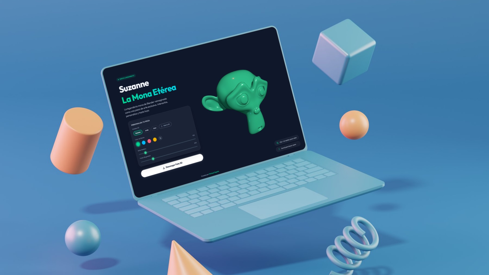

# Portfolio · Michael Zapata

Sitio personal de **Michael Zapata**, creative frontend developer. Experiencias web interactivas y gráficos 3D en el navegador.

**En vivo:** https://michaelzapataag.github.io



## Stack

- **Astro 5** como framework
- **TypeScript**
- **Tailwind CSS 4**
- **GSAP** con ScrollTrigger para las animaciones
- **Three.js** para la escena 3D interactiva

## Características

- Interfaz brutalista con animaciones de entrada y microinteracciones.
- Escena 3D interactiva en WebGL: rota con el mouse y reacciona al scroll.
- Sitio bilingüe (español / inglés) con cambio de idioma.
- Feedback de audio en las interacciones.
- SEO completo: Open Graph, Twitter Card y datos estructurados (JSON-LD).

## Estructura

```
src/
├── components/
│   ├── Portfolio.astro    # Estructura y contenido del sitio
│   └── ThreeScene.astro   # Escena 3D en WebGL
├── pages/
│   ├── index.astro        # Versión en español
│   └── en/index.astro     # Versión en inglés
└── styles/global.css
public/                    # Assets estáticos, robots.txt, sitemap.xml
```

## Desarrollo

```sh
pnpm install
pnpm dev      # servidor local en localhost:4321
pnpm build    # build de producción en ./dist/
pnpm preview  # previsualiza el build
```

## Contacto

- Portfolio · https://michaelzapataag.github.io
- LinkedIn · https://www.linkedin.com/in/michaelzapataag/
- Email · michael.zapata.ag@gmail.com
